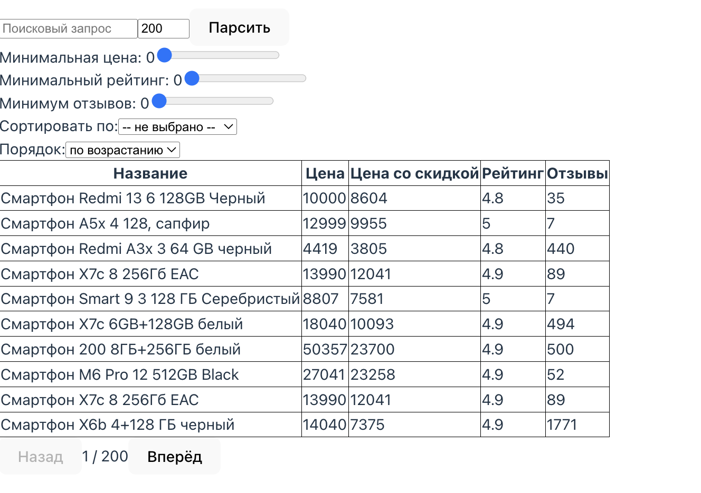
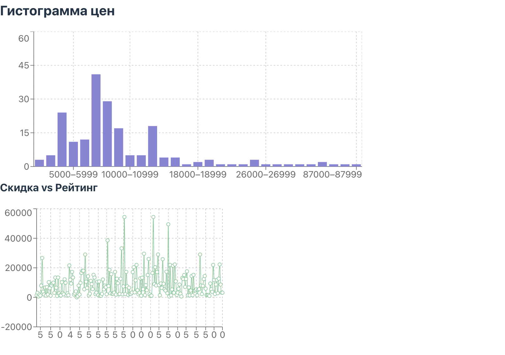

# WB+Front — Аналитика товаров Wildberries

WB+Front — pet‑проект для парсинга и аналитики карточек товаров Wildberries.  
Позволяет анализировать рынок, сравнивать товары и принимать решения о закупках.  
Проект демонстрирует навыки работы с современным Python‑стеком и frontend‑разработкой.

---

## Возможности
- Поиск и парсинг карточек товаров (название, бренд, цена, рейтинг, отзывы).
- Фильтрация и сортировка по цене, рейтингу и количеству отзывов.
- Визуализация данных:
  - гистограмма распределения цен,
  - линейный график скидка vs рейтинг.
- Автоматический парсинг по расписанию (Celery + RabbitMQ).
- Хранение данных в PostgreSQL с асинхронным доступом.

---

## Технологии
- Backend: FastAPI, SQLAlchemy (async), PostgreSQL, Redis, Celery, RabbitMQ  
- Frontend: React (Vite), Tailwind CSS, Recharts  
- Инфраструктура: Docker, Poetry, Alembic  

---

## Скриншоты

| Таблица с товарами | График цен |
|-------------------|------------|
|  |  |

---

## Запуск проекта

```bash
# Клонировать проект
git clone https://github.com/Kirill-Bovin/WB-Front.git
cd WB-Front

# Запуск через Docker
docker-compose up --build
